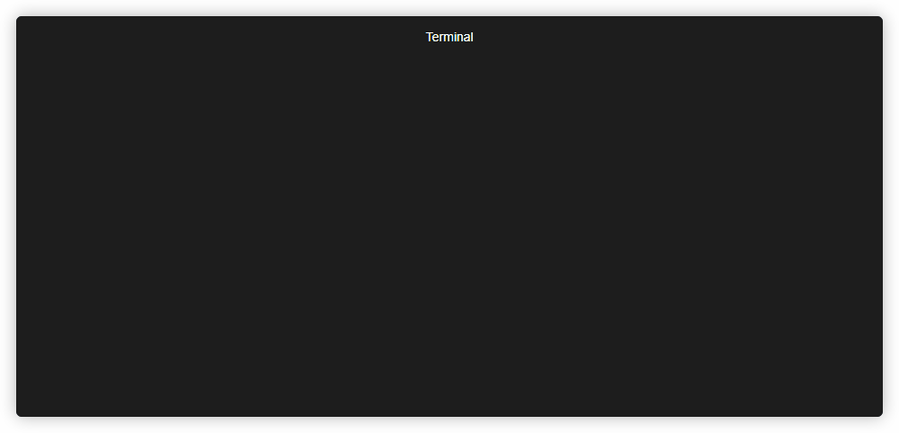

# FinGen - Penetration Testing Findings Generator
FinGen is a ChatGPT based findings generator to help save penetration testers time and provide more readable findings. Note that this tool should not be used to write entire reports without oversight and is not used internally by Stratus but is intended to only be a proof of concept.

It generates findings with the following properties:
- Description
- Remediation
- Implication
- Risk Rating (With likelihood + impact)
- _Sometimes_ extra helpful info like a risk rating justification
> **_NOTE:_**  It generally gives accurate findings but make sure to verify and add context in a real report.  
> Swap the model (see code) if you have GPT-4 for better findings.

## Quick Start
You just need 2 things to run it:
- An API key from OpenAI (https://platform.openai.com/account/api-keys)
- Any finding title
> **_NOTE:_**  The OpenAI API is paid, the cost is ~1c per 100 findings and you can get an $18 free trial.

### Run from pip
```
pip3 install FinGen
python3 -m FinGen --api-key "<api_key>" --title "Auto Complete Not Disabled"
```

### Run from source
```
git clone https://github.com/Stratus-Security/FinGen
cd FinGen
pip3 install openai
python3 FinGen.py --api-key "<api_key>" --title "Auto Complete Not Disabled"
```

## Usage
Generate a single finding with the perspective of a tester from Stratus Security
```
python3 FinGen.py --api-key "<api_key>" --title "Auto Complete Not Disabled" --company "Stratus Security"
```

We can also generate multiple findings at once
```
python3 FinGen.py --api-key "<api_key>" --title "Auto Complete Not Disabled" --title "Blind SQL Injection" --title "Reflected Cross-Site Scripting" 
```

## Demo


## Requests
If you want any features added feel free to open an issue or PR!
